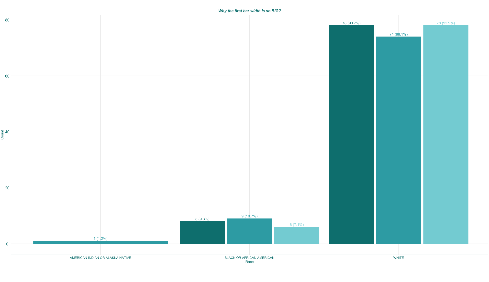
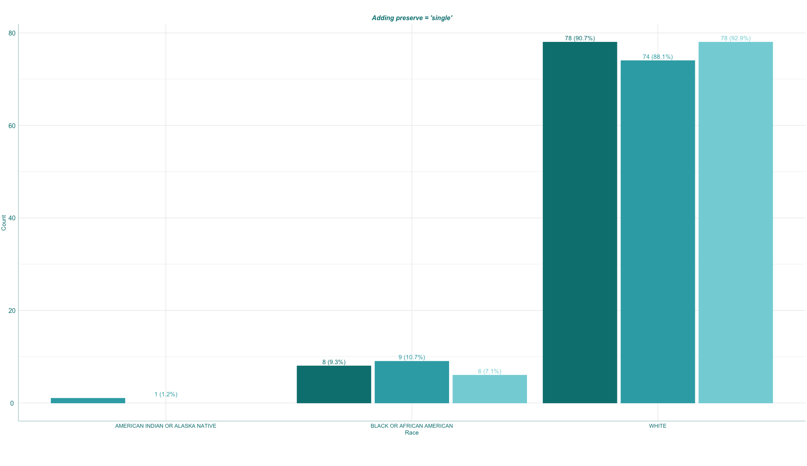
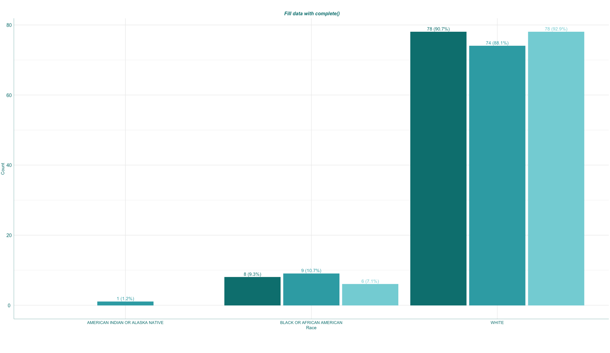

Gggplot tricks
--------------

### Bar plot width

Why the bar widths were so *fat* ?????? when the levels of categorical
variable were missing.

Let’s fix it.

``` r
# read data
adsl <- read_xpt("data/adsl.xpt")
color_fill <- c("#008080","#35aab2","#83d4da")
# create count table
dt <- adsl  %>% count(ARM,RACE) %>% group_by(ARM) %>% mutate( per = (n/ sum(n))*100) %>% mutate( count = paste0(n, " (", sprintf('%.1f', per), "%)"))
source("source/trick_20220506.R")
```


The bar width is too big???? What happened?

``` r
print(dt)
```

    ## # A tibble: 7 × 5
    ## # Groups:   ARM [3]
    ##   ARM                  RACE                                 n   per count     
    ##   <chr>                <chr>                            <int> <dbl> <chr>     
    ## 1 Placebo              BLACK OR AFRICAN AMERICAN            8  9.30 8 (9.3%)  
    ## 2 Placebo              WHITE                               78 90.7  78 (90.7%)
    ## 3 Xanomeline High Dose AMERICAN INDIAN OR ALASKA NATIVE     1  1.19 1 (1.2%)  
    ## 4 Xanomeline High Dose BLACK OR AFRICAN AMERICAN            9 10.7  9 (10.7%) 
    ## 5 Xanomeline High Dose WHITE                               74 88.1  74 (88.1%)
    ## 6 Xanomeline Low Dose  BLACK OR AFRICAN AMERICAN            6  7.14 6 (7.1%)  
    ## 7 Xanomeline Low Dose  WHITE                               78 92.9  78 (92.9%)

``` r
p1 <- ggplot(dt, aes(y = n, x = RACE, colour = ARM, fill = ARM)) +
  geom_bar(stat = 'identity',position = position_dodge(0.95), width = 0.9) +
  geom_text(aes(label = count, colour = ARM), size = 4,vjust= -0.5, position = position_dodge(0.95)) +
  scale_color_manual("",values = c(color_fill)) + 
  scale_fill_manual('', values = c(color_fill))
p1 <- gg_plot_theme(p1, y_label = "Count", x_label = "Race", title = "Why the first bar width is so BIG?", legend = "none")
```



Let fix it! I need to add *preserve = “single”* to *position =
position\_dodge(0.95,preserve = “single”)*

Guess what?

``` r
p2 <- ggplot(dt, aes(y = n, x = RACE, colour = ARM, fill = ARM)) +
  geom_bar(stat = 'identity',, width = 0.9) +
  geom_text(aes(label = count, colour = ARM), size = 4,vjust= -0.5, position = position_dodge(0.95)) +
  scale_color_manual("",values = c(color_fill)) + 
  scale_fill_manual('', values = c(color_fill))
p2 <- gg_plot_theme(p2, y_label = "Count", x_label = "Race", title = "Adding preserve = 'single'", legend = "none")
```



Yeah, it fixed……but……why the labels were off. Oh man, google ……

I get it, let use *complete()* to fix the data

``` r
# Fill data with NA
dt_fill <- data.frame(dt)
dt_fill  <- complete(dt_fill,ARM,RACE)
p3 <- ggplot(dt_fill, aes(y = n, x = RACE, colour = ARM, fill = ARM)) +
     geom_bar(stat = 'identity',position = position_dodge(0.95,preserve = "single"), width = 0.9) +
     geom_text(aes(label = count, colour = ARM), size = 4,vjust= -0.5, position = position_dodge(0.95)) +
     scale_color_manual("",values = c(color_fill)) + 
     scale_fill_manual('', values = c(color_fill))
p3 <- gg_plot_theme(p3, y_label = "Count", x_label = "Race", title = " Fill data with complete()", legend = "none")
```

<<<<<<< HEAD

=======

>>>>>>> 9ab90387b1bbfdded60e0d863353fe50319e55d8
