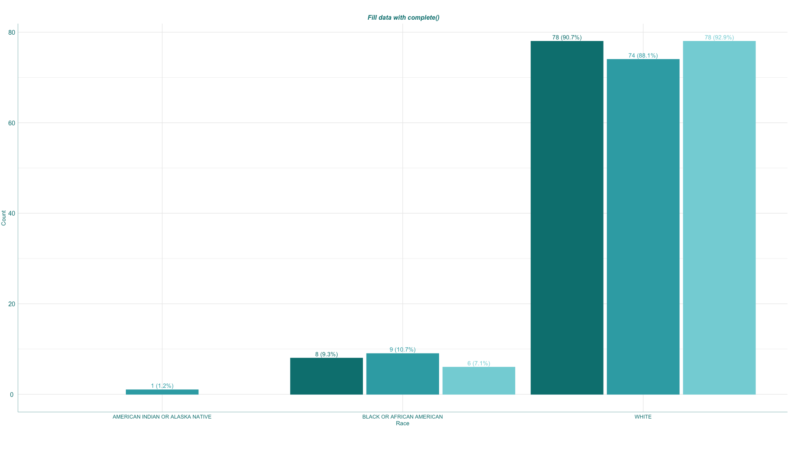

```{r setup, include=FALSE}
knitr::opts_chunk$set(echo = TRUE)
library(haven)
library(tidyverse)
library(ggplot2)
```

## Gggplot tricks {#ggplot}

### Bar plot width {#ggplot_barwidth}


Why the bar widths were so *fat* ?????? when the levels of categorical variable were missing.


Let's fix it. 

```{r  warning=FALSE, message=FALSE}
# read data
adsl <- read_xpt("data/adsl.xpt")
color_fill <- c("#008080","#35aab2","#83d4da")
# create count table
dt <- adsl  %>% count(ARM,RACE) %>% group_by(ARM) %>% mutate( per = (n/ sum(n))*100) %>% mutate( count = paste0(n, " (", sprintf('%.1f', per), "%)"))
source("source/trick_20220506.R")
```


The bar width is too big???? What happened?

```{r  warning=FALSE, message=FALSE}
print(dt)
p1 <- ggplot(dt, aes(y = n, x = RACE, colour = ARM, fill = ARM)) +
  geom_bar(stat = 'identity',position = position_dodge(0.95), width = 0.9) +
  geom_text(aes(label = count, colour = ARM), size = 4,vjust= -0.5, position = position_dodge(0.95)) +
  scale_color_manual("",values = c(color_fill)) + 
  scale_fill_manual('', values = c(color_fill))
p1 <- gg_plot_theme(p1, y_label = "Count", x_label = "Race", title = "Why the first bar width is so BIG?", legend = "none")

```


Let fix it! I need to add *preserve = "single"* to *position = position_dodge(0.95,preserve = "single")*

Guess what? 


```{r  warning=FALSE, message=FALSE}
p2 <- ggplot(dt, aes(y = n, x = RACE, colour = ARM, fill = ARM)) +
  geom_bar(stat = 'identity',, width = 0.9) +
  geom_text(aes(label = count, colour = ARM), size = 4,vjust= -0.5, position = position_dodge(0.95)) +
  scale_color_manual("",values = c(color_fill)) + 
  scale_fill_manual('', values = c(color_fill))
p2 <- gg_plot_theme(p2, y_label = "Count", x_label = "Race", title = "Adding preserve = 'single'", legend = "none")
```


Yeah, it fixed......but......why the labels were off. Oh man, google ......

I get it, let use *complete()* to fix the data 


```{r  warning=FALSE, message=FALSE}
# Fill data with NA
dt_fill <- data.frame(dt)
dt_fill  <- complete(dt_fill,ARM,RACE)
p3 <- ggplot(dt_fill, aes(y = n, x = RACE, colour = ARM, fill = ARM)) +
     geom_bar(stat = 'identity',position = position_dodge(0.95,preserve = "single"), width = 0.9) +
     geom_text(aes(label = count, colour = ARM), size = 4,vjust= -0.5, position = position_dodge(0.95)) +
     scale_color_manual("",values = c(color_fill)) + 
     scale_fill_manual('', values = c(color_fill))
p3 <- gg_plot_theme(p3, y_label = "Count", x_label = "Race", title = " Fill data with complete()", legend = "none")
```



